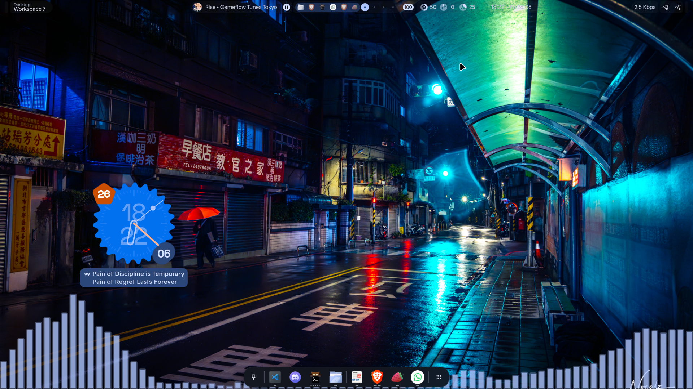
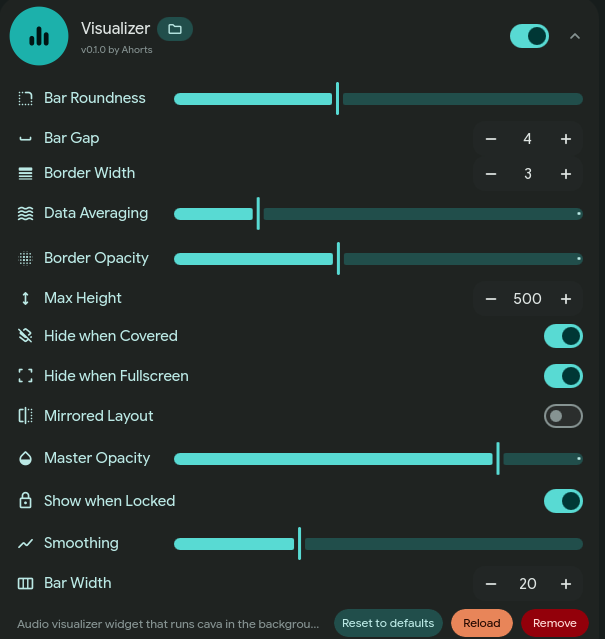

# Vynx Visualizer

A desktop audio visualizer extension for the [ii-vynx](https://github.com/vaguesyntax/ii-vynx) Hyprland shell. It runs CAVA in the background as a dynamic service and renders a highly responsive, custom-styled spectrum bar visualizer anchored at the bottom of the desktop background canvas.

*Visualizer running at the bottom of the desktop background*

*Extension Configuration Settings*

---

## Features

- **Dynamic Background Service**: Automatically spawns and manages `cava` in the background. It dynamically parses the ASCII stream and registers active visualizer widgets.
- **Resource Optimization**: The background CAVA process is only active when at least one visualizer widget is visible on screen. If the workspace is covered by tiled windows, if you enter fullscreen, or if the screen is locked (based on configuration), CAVA shuts down automatically to save CPU cycles.
- **Native QML Animations**: The height of individual spectrum bars is animated smoothly using native QML transition behaviors, bypassing the need for a Javascript-driven FrameAnimation rendering loop.
- **Dynamic Settings Configuration**: Integrated with the shell's extension manager settings UI, complete with customized Material Symbol icons.

---

## Credits

This extension is based on and credits the approach proposed in [end-4/dots-hyprland PR #3158](https://github.com/end-4/dots-hyprland/pull/3158).

Special thanks to:
- **[@ParanoidExtreme](https://github.com/ParanoidExtreme)** — PR Author
- **[@daisith](https://github.com/daisith)** — Discussion Participant
- **[@fb24m](https://github.com/fb24m)** — PR Co-Author
- **[@unixr77](https://github.com/unixr77)** — Discussion Participant
- **[@BharathBala21](https://github.com/BharathBala21)** — Discussion Participant
- **[@kepalakubik](https://github.com/kepalakubik)** — Discussion Participant
- **[@Satoxyan](https://github.com/Satoxyan)** — Discussion Participant

---

## Technical Notes & Limitations

- **Not Fully Optimized**: Please note that this visualizer's rendering approach (using a row of discrete QML Rectangle delegates) may not yet be fully optimized for low-end hardware.
- **Wave Mode Omitted**: Unlike the original PR which proposed both "wave" (oscilloscope line curve canvas) and "bars" modes, **only the frequency spectrum Bars mode is implemented**. The wave-related code has been removed.

---
